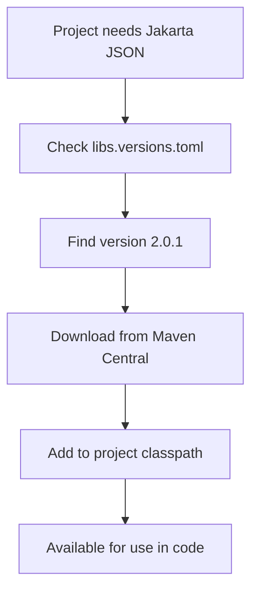
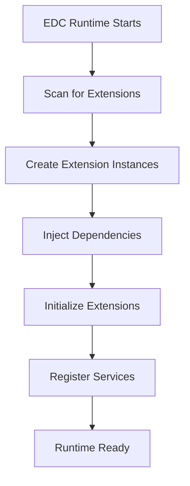
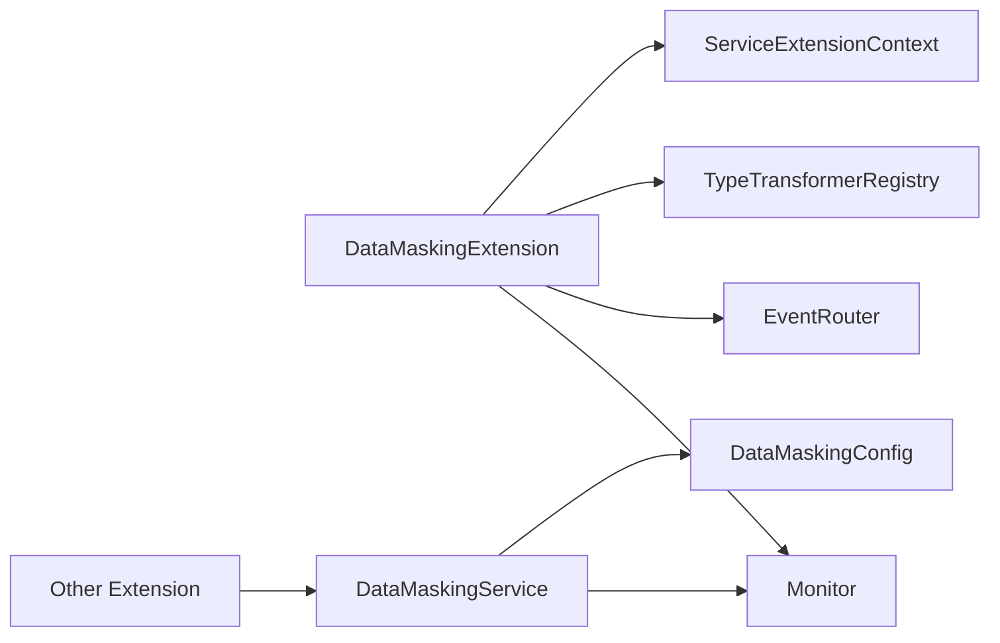

# Dependency Management and Dependency Injection in Tractus-X EDC

## Overview for Non-Java Developers

This guide explains how dependency management and dependency injection work in the Tractus-X EDC project, specifically tailored for team members who may not be familiar with Java ecosystems. We'll use analogies and practical examples to make these concepts clear.

## Table of Contents

1. [What is Dependency Management?](#what-is-dependency-management)
2. [What is Dependency Injection?](#what-is-dependency-injection)
3. [Gradle Build System](#gradle-build-system)
4. [EDC Extension System](#edc-extension-system)
5. [Practical Examples](#practical-examples)
6. [Best Practices](#best-practices)
7. [Troubleshooting](#troubleshooting)

---

## What is Dependency Management?

### Think of it like a Recipe System

Imagine you're running a restaurant (your application). You need:

- **Ingredients** (libraries/dependencies)
- **Suppliers** (repositories)
- **Recipe book** (build configuration)
- **Kitchen staff coordination** (dependency injection)

### In Software Terms

**Dependency Management** is how we:

- Declare what external libraries our project needs
- Specify which versions to use
- Handle conflicts when multiple parts need different versions
- Download and organize these libraries

### Example: Our Data Masking Extension

```kotlin
// In build.gradle.kts - This is like our "shopping list"
dependencies {
    // We need JSON processing capabilities
    implementation(libs.jakartaJson)

    // We need EDC core functionality
    implementation(libs.edc.spi.core)

    // We need transformation utilities
    implementation(libs.edc.spi.transform)
}
```

**Translation**: "For our data masking feature to work, we need:

- A JSON processing library (like a food processor)
- EDC's core services (like basic kitchen equipment)
- Data transformation tools (like specialized cooking utensils)"

---

## What is Dependency Injection?

### Think of it like a Restaurant Service System

In a restaurant:

- **Traditional approach**: Each chef goes to the storage room to get their own ingredients
- **Dependency Injection**: A central service delivers the right ingredients to each chef when needed

### In Software Terms

**Dependency Injection** automatically provides objects with the services they need, rather than forcing them to create or find these services themselves.

### Without Dependency Injection (❌ Bad)

```java
public class DataMaskingService {
    private Monitor monitor;

    public DataMaskingService() {
        // Service has to create its own dependencies
        this.monitor = new FileBasedMonitor(); // Hard-coded!
        // What if we want database logging? We'd have to change this code!
    }
}
```

### With Dependency Injection (✅ Good)

```java
public class DataMaskingService {
    private Monitor monitor;

    // The EDC framework will provide the monitor automatically
    public DataMaskingService(Monitor monitor) {
        this.monitor = monitor; // Flexible! Can be any type of monitor
    }
}
```

---

## Gradle Build System

### What is Gradle?

Gradle is like a **smart project manager** that:

- Downloads required libraries
- Compiles your code
- Runs tests
- Creates deployable packages
- Manages complex build processes

### Project Structure

```
tractusx-edc/
├── build.gradle.kts           # Main project configuration
├── settings.gradle.kts        # Project structure definition
├── gradle/
│   └── libs.versions.toml     # Centralized version management
└── edc-extensions/
    └── data-masking/
        └── build.gradle.kts   # Module-specific dependencies
```

### Version Management with `libs.versions.toml`

This file is like a **centralized price list** for all our dependencies:

```toml
[versions]
edc = "0.14.0-20250626-SNAPSHOT"    # EDC framework version
jackson = "2.19.1"                   # JSON processing library
jakarta-json = "2.0.1"              # JSON API standard

[libraries]
edc-spi-core = { module = "org.eclipse.edc:core-spi", version.ref = "edc" }
jakartaJson = { module = "org.glassfish:jakarta.json", version.ref = "jakarta-json" }
```

**Benefits**:

- ✅ All versions in one place
- ✅ Easy to update dependencies across entire project
- ✅ Prevents version conflicts
- ✅ Team consistency

### How Dependencies are Resolved



---

## EDC Extension System

### What is an Extension?

Think of EDC extensions like **plugin modules for a video game**:

- Each extension adds specific functionality
- Extensions can depend on other extensions
- The main framework coordinates everything
- Extensions can be enabled/disabled independently

### Extension Lifecycle



### Dependency Injection Annotations

#### `@Extension` - Marks a Class as an Extension

```java
@Extension(value = "Data Masking Extension", categories = { "security", "privacy" })
public class DataMaskingExtension implements ServiceExtension {
    // This tells EDC: "I'm an extension that provides security and privacy features"
}
```

#### `@Inject` - Request Dependencies

```java
@Inject
private Monitor monitor;           // "I need a logging service"

@Inject
private EventRouter eventRouter;  // "I need an event publishing service"

@Inject
private TypeTransformerRegistry transformerRegistry; // "I need a transformation registry"
```

**Think of `@Inject` like ordering room service**: You specify what you need, and the hotel (EDC framework) delivers it to your room (extension).

#### `@Provider` - Offer Services to Others

```java
@Provider
public DataMaskingService createDataMaskingService(ServiceExtensionContext context) {
    // "I can provide a data masking service to anyone who needs it"
    return new DataMaskingServiceImpl(monitor, config);
}
```

#### `@Setting` - Configuration Parameters

```java
@Setting(value = "Enable data masking", key = "edc.datamasking.enabled", defaultValue = "true")
public static final String MASKING_ENABLED = "edc.datamasking.enabled";
```

**Like a settings menu in an app**: Users can configure behavior without changing code.

---

## Practical Examples

### Example 1: Data Masking Extension

Let's walk through our actual data masking extension:

```java
@Extension(value = "Data Masking Extension", categories = { "security", "privacy", "dataplane" })
public class DataMaskingExtension implements ServiceExtension {

    // 1. CONFIGURATION - What settings do we need?
    @Setting(value = "Masking strategy: PARTIAL, FULL, HASH",
             key = "edc.datamasking.strategy",
             defaultValue = "PARTIAL")
    public static final String MASKING_STRATEGY = "edc.datamasking.strategy";

    // 2. DEPENDENCIES - What services do we need?
    @Inject
    private Monitor monitor;                    // For logging

    @Inject
    private EventRouter eventRouter;           // For publishing events

    @Inject
    private TypeTransformerRegistry transformerRegistry; // For data transformation

    // 3. INITIALIZATION - Set up our extension
    @Override
    public void initialize(ServiceExtensionContext context) {
        var strategy = context.getSetting(MASKING_STRATEGY, "PARTIAL");
        monitor.info("Initializing Data Masking with strategy: " + strategy);

        // Register for audit events if needed
        if (auditEnabled) {
            eventRouter.register(DataMaskingEvent.class, new DataMaskingAuditSubscriber(monitor));
        }

        // Register our transformer
        var maskingService = createDataMaskingService(context);
        var transformer = new JsonObjectAssetMaskingTransformer(jsonFactory, maskingService);
        transformerRegistry.register(transformer);
    }

    // 4. SERVICE PROVISION - What services do we offer?
    @Provider
    public DataMaskingService createDataMaskingService(ServiceExtensionContext context) {
        var config = buildConfigFromSettings(context);
        return new DataMaskingServiceImpl(monitor, config);
    }
}
```

**What happens here?**

1. **EDC discovers our extension** (like finding a new restaurant)
2. **EDC creates an instance** (like setting up the kitchen)
3. **EDC injects dependencies** (like delivering ingredients)
4. **Our extension initializes** (like preparing the mise en place)
5. **We register our services** (like adding items to the menu)
6. **Other extensions can use our services** (like customers ordering food)

### Example 2: Dependency Chain



**Reading this diagram**:

- Our extension **depends on** Monitor, EventRouter, etc.
- Our extension **provides** DataMaskingService
- Other extensions can **use** our DataMaskingService

### Example 3: Testing with Dependency Injection

```java
@ExtendWith(DependencyInjectionExtension.class)  // Special test runner
class DataMaskingExtensionTest {

    // Test setup - we provide mock dependencies
    @BeforeEach
    void setup(ServiceExtensionContext context) {
        context.registerService(Monitor.class, new TestMonitor());
        context.registerService(EventRouter.class, mock(EventRouter.class));
    }

    // Test - the framework injects our mocks
    @Test
    void shouldInitializeExtension(DataMaskingExtension extension, ServiceExtensionContext context) {
        extension.initialize(context);

        var service = extension.createDataMaskingService(context);
        assertNotNull(service);
    }
}
```

---

## Best Practices

### 1. Dependency Declaration

#### ✅ Good - Specific and Clear

```kotlin
dependencies {
    // Clear purpose, specific module
    implementation(libs.edc.spi.core)           // Core EDC functionality
    implementation(libs.jakartaJson)            // JSON processing

    // Test dependencies separate
    testImplementation(libs.edc.junit)
}
```

#### ❌ Bad - Vague or Over-broad

```kotlin
dependencies {
    // Too broad - imports everything
    implementation("org.eclipse.edc:*")

    // Unclear purpose
    implementation("some.random:library:1.0")
}
```

### 2. Dependency Injection

#### ✅ Good - Clean Dependencies

```java
public class DataMaskingExtension implements ServiceExtension {
    @Inject
    private Monitor monitor;                    // Interface, not implementation

    @Inject
    private EventRouter eventRouter;           // Core EDC service

    // Constructor injection for services we create
    public DataMaskingService createService() {
        return new DataMaskingServiceImpl(monitor, config);
    }
}
```

#### ❌ Bad - Tight Coupling

```java
public class DataMaskingExtension implements ServiceExtension {
    // Don't create dependencies directly!
    private Monitor monitor = new FileMonitor("/var/log/app.log");

    // Don't use static dependencies!
    private EventRouter eventRouter = EventRouterFactory.getInstance();
}
```

### 3. Configuration Management

#### ✅ Good - Centralized and Documented

```java
@Setting(value = "Enable data masking for sensitive fields",
         key = "edc.datamasking.enabled",
         defaultValue = "true")
public static final String MASKING_ENABLED = "edc.datamasking.enabled";
```

#### ❌ Bad - Hard-coded Values

```java
// Don't hard-code configuration!
private boolean maskingEnabled = true;
private String strategy = "PARTIAL";
```

### 4. Service Registration

#### ✅ Good - Clear Service Contracts

```java
@Provider
public DataMaskingService createDataMaskingService(ServiceExtensionContext context) {
    // Build configuration from settings
    var config = DataMaskingConfig.builder()
        .strategy(getStrategy(context))
        .fieldsToMask(getFields(context))
        .build();

    return new DataMaskingServiceImpl(monitor, config);
}
```

#### ❌ Bad - Unclear or Complex Providers

```java
@Provider
public Object createSomething() {  // What does this provide?
    // Complex logic that should be in a separate method
    var x = new ComplexBuilder().with(this).and(that).build();
    return x.getSomething().orElse(null);
}
```

---

## Troubleshooting

### Common Issues and Solutions

#### 1. "No suitable service found"

**Error**:

```
No service of type 'com.example.MyService' found
```

**Cause**: The service you're trying to inject isn't provided by any extension.

**Solution**:

```java
// Make sure someone provides this service
@Provider
public MyService createMyService() {
    return new MyServiceImpl();
}
```

#### 2. "Circular dependency detected"

**Error**:

```
Circular dependency: A depends on B, B depends on A
```

**Cause**: Two services depend on each other directly.

**Solution**:

```java
// Use an event-based approach or introduce an intermediary
@Inject
private EventRouter eventRouter;  // Instead of direct dependency

public void notifyOtherService(Data data) {
    eventRouter.publish(new DataEvent(data));
}
```

#### 3. "Version conflict"

**Error**:

```
Cannot resolve version conflict between library-1.0 and library-2.0
```

**Solution**:

```kotlin
// In libs.versions.toml, force a specific version
implementation("com.example:library") {
    version {
        strictly("2.0")  // Force this version
    }
}
```

#### 4. "Extension not loading"

**Checklist**:

- ✅ Class annotated with `@Extension`?
- ✅ Implements `ServiceExtension`?
- ✅ Listed in `module-info.java` or similar?
- ✅ Dependencies properly declared?

### Debugging Dependency Issues

#### 1. Check Extension Loading

```bash
# Look for extension loading logs
./gradlew run | grep -i "extension"
```

#### 2. Verify Dependencies

```bash
# Show dependency tree
./gradlew dependencies
```

#### 3. Check Service Registration

```java
// Add debug logging in your extension
@Override
public void initialize(ServiceExtensionContext context) {
    monitor.info("DataMaskingExtension starting initialization");

    // Check if dependencies are available
    if (eventRouter != null) {
        monitor.info("EventRouter available");
    } else {
        monitor.warning("EventRouter not available");
    }
}
```

---

## Comparison with Other Systems

### For Frontend Developers (npm/yarn)

| Concept              | Java/Gradle           | JavaScript/npm                       |
| -------------------- | --------------------- | ------------------------------------ |
| Dependency file      | `build.gradle.kts`    | `package.json`                       |
| Lock file            | `gradle.lockfile`     | `package-lock.json`                  |
| Version management   | `libs.versions.toml`  | `package.json` versions              |
| Dependency injection | `@Inject` annotations | Constructor parameters/DI frameworks |
| Module system        | `module-info.java`    | ES6 modules/CommonJS                 |

### For Python Developers

| Concept              | Java/Gradle           | Python                                         |
| -------------------- | --------------------- | ---------------------------------------------- |
| Dependency file      | `build.gradle.kts`    | `requirements.txt` / `pyproject.toml`          |
| Package manager      | Gradle                | pip / poetry                                   |
| Virtual environment  | Each project isolated | `venv` / `conda`                               |
| Dependency injection | Framework-based       | Usually manual or using frameworks like Django |

### For .NET Developers

| Concept              | Java/Gradle        | C#/.NET                              |
| -------------------- | ------------------ | ------------------------------------ |
| Build system         | Gradle             | MSBuild / dotnet CLI                 |
| Dependency file      | `build.gradle.kts` | `.csproj`                            |
| Package manager      | Maven Central      | NuGet                                |
| Dependency injection | `@Inject`          | Constructor injection / DI container |

---

## Advanced Topics

### 1. Extension Dependencies

Extensions can depend on other extensions:

```java
@Extension(value = "Advanced Masking",
           dependencies = { "Data Masking Extension" })  // Requires our basic extension
public class AdvancedMaskingExtension implements ServiceExtension {

    @Inject
    private DataMaskingService basicMaskingService;  // From the basic extension

    @Provider
    public AdvancedMaskingService createAdvancedService() {
        return new AdvancedMaskingServiceImpl(basicMaskingService);
    }
}
```

### 2. Conditional Service Registration

```java
@Provider
public DataMaskingService createDataMaskingService(ServiceExtensionContext context) {
    var enabled = context.getSetting(MASKING_ENABLED, "true");

    if ("true".equalsIgnoreCase(enabled)) {
        return new DataMaskingServiceImpl(monitor, config);
    } else {
        return new NoOpDataMaskingService();  // Null object pattern
    }
}
```

### 3. Service Factories

```java
@Provider
public DataMaskingServiceFactory createFactory(ServiceExtensionContext context) {
    return new DataMaskingServiceFactory() {
        @Override
        public DataMaskingService createForStrategy(MaskingStrategy strategy) {
            var config = configForStrategy(strategy);
            return new DataMaskingServiceImpl(monitor, config);
        }
    };
}
```

---

## Key Takeaways

### For Non-Java Developers

1. **Dependency Management = Shopping List**: Gradle manages what libraries we need
2. **Dependency Injection = Room Service**: Framework delivers what you need
3. **Extensions = Plugins**: Modular functionality that can be combined
4. **Annotations = Labels**: `@Inject`, `@Provider`, etc. tell the framework what to do
5. **Configuration = Settings Menu**: Users can customize behavior without code changes

### Benefits of This Approach

- ✅ **Modularity**: Features can be developed and tested independently
- ✅ **Flexibility**: Easy to swap implementations
- ✅ **Testability**: Mock dependencies for unit testing
- ✅ **Maintainability**: Clear separation of concerns
- ✅ **Scalability**: Add new features without changing existing code

### Remember

- **Don't create dependencies manually** - let the framework inject them
- **Use interfaces, not implementations** - keeps code flexible
- **Configuration over hard-coding** - makes the system adaptable
- **Test with mocks** - isolate the code you're testing

---

## Resources

### Documentation

- [EDC Developer Guide](docs/DEVELOPER_GUIDE.md)
- [Gradle User Manual](https://docs.gradle.org/current/userguide/userguide.html)
- [Java Module System](https://www.oracle.com/corporate/features/understanding-java-9-modules.html)

### Tools

- **IntelliJ IDEA**: Excellent Java IDE with Gradle integration
- **VS Code**: Good alternative with Java extensions
- **Gradle Build Scan**: Analyze build performance and dependencies

### Getting Help

- EDC community forums
- Stack Overflow (tag: `eclipse-edc`)
- Project documentation and examples

---

**Document Version**: 1.0  
**Last Updated**: August 2025  
**Target Audience**: Non-Java developers new to EDC  
**Maintainer**: Development Team
