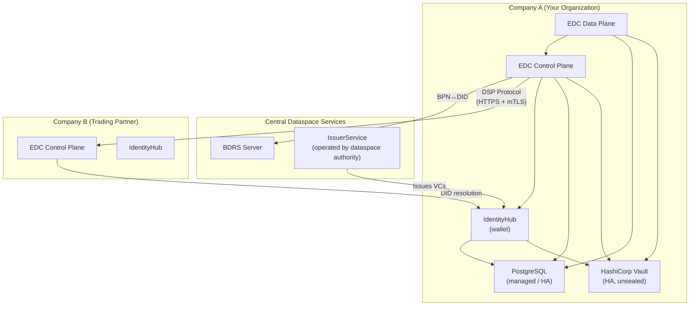
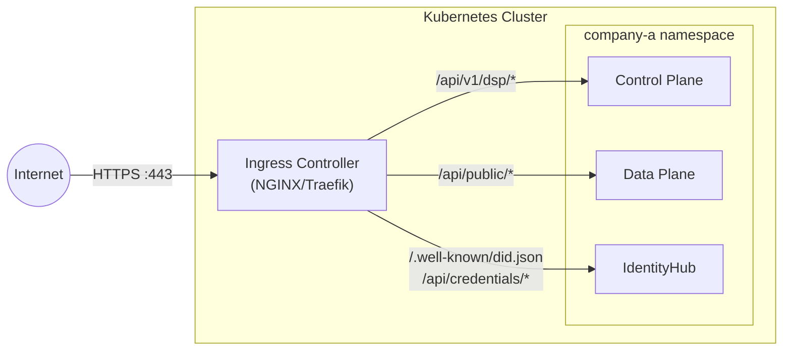

# Production Deployment Guide — Tractus-X EDC with DCP

**Audience**: Infrastructure / DevOps / Platform engineers  
**Purpose**: Everything that must change when moving from the local Docker Compose
development setup to a production (or staging) Kubernetes deployment, and **why**.

> This guide assumes familiarity with the local deployment documented in
> [`deployment/local/README.md`](README.md). That setup deliberately takes shortcuts
> for developer convenience — every shortcut is catalogued below with its production fix.

---

## Table of Contents

- [Architecture Recap](#architecture-recap)
- [1. Secrets & Vault](#1-secrets--vault)
- [2. TLS / HTTPS](#2-tls--https)
- [3. DID Configuration](#3-did-configuration)
- [4. Database](#4-database)
- [5. Docker Images](#5-docker-images)
- [6. Networking & Ingress](#6-networking--ingress)
- [7. API Authentication](#7-api-authentication)
- [8. Credential Issuance & Trust Anchors](#8-credential-issuance--trust-anchors)
- [9. BDRS (BPN Directory)](#9-bdrs-bpn-directory)
- [10. Data Plane & Transfer Proxy](#10-data-plane--transfer-proxy)
- [11. Observability & Logging](#11-observability--logging)
- [12. High Availability & Scaling](#12-high-availability--scaling)
- [13. Backup & Disaster Recovery](#13-backup--disaster-recovery)
- [14. Environment-Specific Config Summary](#14-environment-specific-config-summary)
- [15. Deployment Checklist](#15-deployment-checklist)
- [Appendix A: Property File Reference](#appendix-a-property-file-reference)
- [Appendix B: Helm Chart Pointers](#appendix-b-helm-chart-pointers)

---

## Architecture Recap



In production, **each company deploys its own stack** (IdentityHub, Control Plane,
Data Plane, Vault, PostgreSQL). The IssuerService and BDRS are operated by the
dataspace authority (e.g., Catena-X operating company).

---

## 1. Secrets & Vault

### What's different locally

| Item | Local Value | Why it's insecure |
|------|------------|-------------------|
| Vault root token | `root` (hardcoded in docker-compose) | Root token = full access, no audit trail |
| Vault mode | `dev` server (in-memory, auto-unsealed) | Data lost on restart, no seal protection |
| Vault protocol | `http://` | Secrets transmitted in plaintext |
| DB passwords | `provider` / `consumer` / `postgres` | Trivial to guess, same as username |
| STS client secrets | Stored via `curl` to Vault HTTP API | Bootstrap script has plaintext secrets |
| Super-user API key | `c3VwZXItdXNlcg==.superuserkey` | Hardcoded, shared across all IH instances |
| Transfer proxy keys | Generated at bootstrap time, stored in Vault | No key rotation, shared Vault token |

### Production requirements

**Vault:**
```
# NEVER use dev mode in production
edc.vault.hashicorp.url=https://vault.internal.company.com:8200
edc.vault.hashicorp.token=<AppRole/Kubernetes auth token>
```

- Deploy Vault in **HA mode** (Raft or Consul backend) with auto-unseal (AWS KMS, Azure Key Vault, or GCP Cloud KMS).
- Use **AppRole** or **Kubernetes auth** method instead of a static root token. The connector's service account gets a scoped Vault token at startup via the Vault Agent sidecar or CSI driver.
- Enable **audit logging** on Vault.
- Restrict Vault policies to least-privilege: each connector should only access its own secret path (e.g., `secret/data/company-a/*`).

**Database passwords:**
- Generate strong random passwords (32+ chars).
- Store in Vault or Kubernetes Secrets (sealed with SOPS/age or external-secrets-operator).
- Rotate periodically.

**STS client secrets:**
- Generated during participant onboarding (IdentityHub API).
- Store in Vault immediately; never log or persist in scripts.

**Super-user API key:**
- Generate a unique, high-entropy key per IdentityHub instance.
- Restrict usage to admin operations only; use short-lived tokens for automated workflows.

**Transfer proxy signing keys:**
- Use a dedicated **EC P-256** key pair per Data Plane instance.
- Rotate keys on a schedule (e.g., every 90 days). The old public key must remain verifiable until all outstanding EDR tokens expire.

---

## 2. TLS / HTTPS

### What's different locally

```properties
# Local: HTTPS disabled for did:web resolution
edc.iam.did.web.use.https=false

# Local: All inter-service communication is plain HTTP
edc.dsp.callback.address=http://provider-cp:8084/api/v1/dsp
edc.iam.sts.oauth.token.url=http://provider-ih:9292/api/sts/token
```

### Why this matters

- **`did:web` specification requires HTTPS** — `did:web:example.com:company` resolves to
  `https://example.com/company/did.json`. Without HTTPS, DID resolution is vulnerable to
  MITM attacks, and other dataspace participants will reject your DIDs.
- **DSP protocol** messages contain contract offers, agreement terms, and transfer tokens.
  Without TLS, these are exposed on the wire.
- **STS token endpoint** issues JWTs that grant access to connector APIs. HTTP exposure
  means token theft via network sniffing.

### Production requirements

```properties
# MUST be true in production
edc.iam.did.web.use.https=true

# All endpoints use HTTPS
edc.dsp.callback.address=https://connector.company.com/api/v1/dsp
edc.iam.sts.oauth.token.url=https://identityhub.company.com/api/sts/token
```

- Terminate TLS at the **ingress controller** (NGINX, Traefik, Istio Gateway) or at a load balancer.
- Use valid certificates from a public CA (Let's Encrypt, DigiCert) or your organization's internal CA.
- For inter-service communication within the cluster, use a **service mesh** (Istio, Linkerd) with mutual TLS (mTLS) or Kubernetes-native TLS.
- The Data Plane **public API** endpoint must be HTTPS — it's reachable by external consumers fetching data via EDR tokens.

---

## 3. DID Configuration

### What's different locally

```
# Local DIDs use Docker container hostnames
did:web:provider-ih:provider     → resolves to http://provider-ih:80/provider/did.json
did:web:consumer-ih:consumer     → resolves to http://consumer-ih:80/consumer/did.json
did:web:issuerservice:issuer     → resolves to http://issuerservice:80/issuer/did.json
```

### Production requirements

DIDs must resolve over the **public internet** via HTTPS:

```
did:web:identityhub.company-a.com:company-a
  → resolves to https://identityhub.company-a.com/company-a/did.json
```

**What to change:**

| Property | Local | Production |
|----------|-------|------------|
| `edc.participant.id` (CP) | `did:web:provider-ih:provider` | `did:web:identityhub.company.com:company` |
| `edc.iam.issuer.id` (CP/DP) | `did:web:provider-ih:provider` | `did:web:identityhub.company.com:company` |
| `edc.iam.sts.oauth.client.id` (CP/DP) | `did:web:provider-ih:provider` | `did:web:identityhub.company.com:company` |
| IdentityHub DID web path | `:80/` (plain HTTP) | `:443/` (HTTPS via ingress) |

**DNS requirements:**
- The hostname in the DID (e.g., `identityhub.company.com`) must be a publicly resolvable DNS name.
- The `/.well-known/did.json` or `/{path}/did.json` endpoint must be reachable from any dataspace participant.
- Consider using a CDN or reverse proxy in front of the DID endpoint for reliability and DDoS protection.

**Key management:**
- The DID Document contains public verification keys. The corresponding private keys must be in Vault.
- Key rotation: publish a new key in the DID Document, transition VCs to the new key, then remove the old key.

---

## 4. Database

### What's different locally

```yaml
# docker-compose: PostgreSQL with trivial credentials
POSTGRES_USER: provider
POSTGRES_PASSWORD: provider
POSTGRES_DB: provider
```

```properties
# Properties: Plain-text password, no SSL
edc.datasource.default.url=jdbc:postgresql://provider-postgres:5432/provider_edc
edc.datasource.default.user=provider
edc.datasource.default.password=provider
```

### Production requirements

| Concern | Local | Production |
|---------|-------|------------|
| **Engine** | PostgreSQL 16 Alpine (container) | Managed PostgreSQL (AWS RDS, Azure Database for PostgreSQL, GCP Cloud SQL) or self-managed HA cluster |
| **Credentials** | Plaintext in properties file | Vault-injected or Kubernetes Secret (external-secrets-operator) |
| **Connection** | `jdbc:postgresql://` (no SSL) | `jdbc:postgresql://?sslmode=require&sslrootcert=/path/to/ca.pem` |
| **Databases** | Single Postgres instance, multiple DBs | Separate instances or at minimum separate users with RBAC |
| **Backups** | None (Docker volume) | Automated daily backups with point-in-time recovery (PITR) |
| **Migration** | `tx.edc.postgresql.migration.enabled=true` (auto on startup) | Run migrations in a controlled pipeline (CI/CD job), not at application startup |
| **Connection pooling** | Default (HikariCP defaults) | Tune pool size (`edc.datasource.default.pool.size`), use PgBouncer if needed |

**Database separation strategy:**

Each company stack requires **3 logical databases** (can be on the same PostgreSQL instance
with separate schemas/users, or on separate instances for isolation):

| Database | Used By | Tables |
|----------|---------|--------|
| `company_edc` | Control Plane, Data Plane | Assets, policies, contract definitions, agreements, transfers |
| `company_ih` | IdentityHub | Participants, DIDs, key pairs, credentials, STS clients |
| `bdrs` | BDRS Server | BPN ↔ DID directory mappings |

**Recommended:** Use separate database **users** with schema-level permissions even if
sharing a PostgreSQL instance. The Control Plane should not have write access to the
IdentityHub tables and vice versa.

---

## 5. Docker Images

### What's different locally

```bash
# Local: built from source, tagged :local
docker build -t edc-controlplane:local ...
docker build -t edc-dataplane:local ...
docker build -t identityhub:local ...
```

The local Dockerfile strips the OTEL Java agent and uses a simplified entrypoint.

### Production requirements

- **Use versioned, signed images** from a private container registry (e.g., `registry.company.com/tractusx-edc/controlplane:0.12.0`).
- **Enable OTEL** (OpenTelemetry Java Agent) for distributed tracing:
  ```dockerfile
  COPY opentelemetry-javaagent.jar /app/opentelemetry-javaagent.jar
  ENTRYPOINT ["java", \
       "-javaagent:/app/opentelemetry-javaagent.jar", \
       "-Dotel.service.name=edc-controlplane", \
       "-Dotel.exporter.otlp.endpoint=http://otel-collector:4317", \
       "-Dedc.fs.config=/app/configuration.properties", \
       "-jar", "edc-runtime.jar"]
  ```
- **Scan images** for CVEs (Trivy, Grype, Snyk) in the CI pipeline before pushing to registry.
- **Non-root user** — already configured in the Dockerfile (`APP_UID=10100`), keep this.
- **Resource limits** — set memory and CPU limits in Kubernetes manifests:
  ```yaml
  resources:
    requests:
      memory: "512Mi"
      cpu: "250m"
    limits:
      memory: "2Gi"
      cpu: "1000m"
  ```
- **Health check** — the existing `wget --spider` health check works but in Kubernetes, use livenessProbe and readinessProbe instead:
  ```yaml
  livenessProbe:
    httpGet:
      path: /api/check/health
      port: 8080
    initialDelaySeconds: 30
    periodSeconds: 15
  readinessProbe:
    httpGet:
      path: /api/check/readiness
      port: 8080
    initialDelaySeconds: 15
    periodSeconds: 10
  ```

---

## 6. Networking & Ingress

### What's different locally

- All 14 containers on a single Docker bridge network (`edc-net`).
- Services reference each other by container name (e.g., `provider-cp`, `provider-ih`).
- Ports exposed directly to `localhost` (19191, 19193, etc.).
- No firewall rules, no network policies.

### Production requirements



**Ingress routes (what must be externally reachable):**

| Endpoint | Path | Exposed To | Purpose |
|----------|------|-----------|---------|
| Control Plane DSP | `/api/v1/dsp/*` | Other dataspace connectors | Protocol messages (catalog, negotiation, transfer) |
| Data Plane Public | `/api/public/*` | Data consumers (via EDR) | Data transfer (PULL mode) |
| IdentityHub DID | `/{participant}/did.json` | Public internet | DID Document resolution |
| IdentityHub Credentials | `/api/credentials/*` | Other dataspace connectors | VP/VC presentation queries |

**What must NOT be externally reachable:**

| Endpoint | Path | Why |
|----------|------|-----|
| Management API | `/management/*` | Full admin access to assets, policies, contracts |
| Control API | `/control/*` | Internal Data Plane ↔ Control Plane signaling |
| Identity/Admin API | `/api/identity/*` | Participant CRUD, key management |
| STS endpoint | `/api/sts/*` | Token issuance (internal use by connector) |
| Issuer Admin API | `/api/issuer/*` | Credential definitions, holder management |
| Database | Port 5432 | Direct DB access |
| Vault | Port 8200 | Secret storage |

**Kubernetes Network Policies:**

```yaml
# Example: Only allow Control Plane to reach IdentityHub STS
apiVersion: networking.k8s.io/v1
kind: NetworkPolicy
metadata:
  name: allow-cp-to-ih-sts
spec:
  podSelector:
    matchLabels:
      app: identityhub
  ingress:
    - from:
        - podSelector:
            matchLabels:
              app: controlplane
      ports:
        - port: 9292    # STS
        - port: 13131   # Credentials
```

**DNS:**
- Use Kubernetes Services for internal communication (e.g., `controlplane.company-a.svc.cluster.local`).
- Use external DNS names for cross-company communication (e.g., `connector.company-a.com`).
- Update `edc.dsp.callback.address` to the external HTTPS URL.

---

## 7. API Authentication

### What's different locally

```properties
# Simple shared static key
web.http.management.auth.type=tokenbased
web.http.management.auth.key=testkey
```

### Production requirements

| Approach | When to use |
|----------|------------|
| **Token-based with strong keys** | Minimum viable — generate a unique 256-bit key per environment, store in Vault, rotate quarterly |
| **OAuth2 / OIDC** | Recommended — integrate with your organization's identity provider (Keycloak, Azure AD, Okta). The Management API accepts Bearer tokens validated against your OAuth2 server |

**Key changes:**

```properties
# Option A: Strong static key (minimum)
web.http.management.auth.type=tokenbased
web.http.management.auth.key=<256-bit-random-base64-key-from-vault>

# Option B: OAuth2 (recommended)
web.http.management.auth.type=oidc
web.http.management.auth.oidc.issuer=https://idp.company.com/realms/edc
web.http.management.auth.oidc.audience=edc-management-api
```

**Additional hardening:**
- Rate-limit the Management API.
- Log all Management API calls (who did what, when).
- Use separate API keys/tokens for CI/CD pipelines vs interactive admin use.
- The IdentityHub super-user key should be treated like a root credential — use it only for initial bootstrap, then switch to scoped API tokens.

---

## 8. Credential Issuance & Trust Anchors

### What's different locally

- The `issuerservice` runs on the same Docker network, bootstrapped by a shell script.
- Credentials are issued automatically by `bootstrap.sh` with no human approval.
- Trusted issuer is hardcoded:
  ```properties
  edc.iam.trusted-issuer.issuer.id=did:web:issuerservice:issuer
  ```

### Production requirements

**Trusted Issuer:**

In production, the trusted issuer is the **Catena-X operating company** (or your
dataspace authority's issuance service). Their DID will look like:
```properties
edc.iam.trusted-issuer.issuer.id=did:web:issuer.catena-x.net:catena-x
```

This is a **critical security setting** — it determines whose Verifiable Credentials
your connector will accept. Only trust issuers that have been verified through your
dataspace's onboarding process.

**Credential lifecycle:**
- **Issuance**: Credentials are issued through a formal onboarding process (application → verification → issuance), not a shell script.
- **Renewal**: Monitor credential expiry. Set up alerting when credentials are within 30 days of expiry. The IdentityHub has a credential watchdog:
  ```properties
  # Check every 60 seconds for expiring credentials
  edc.iam.credential.status.check.period=60
  edc.iam.credential.renewal.graceperiod=604800   # 7 days
  ```
- **Revocation**: If a credential is compromised, the issuer revokes it via the status list. The connector checks revocation status:
  ```properties
  edc.iam.credential.revocation.cache.validity=900000   # 15 min cache
  ```
  In production, consider a shorter cache validity (e.g., 5 minutes) for faster revocation propagation.

**Credential types required for Catena-X:**

| Credential | Issued By | Purpose |
|-----------|-----------|---------|
| `MembershipCredential` | Catena-X operating company | Proves active dataspace membership |
| `BpnCredential` | Catena-X operating company | Binds BPN to DID |
| `DataExchangeGovernanceCredential` | Catena-X operating company | Authorizes data exchange under framework agreements |

---

## 9. BDRS (BPN Directory)

### What's different locally

```yaml
# docker-compose: BDRS reuses issuer-vault with root token
EDC_VAULT_HASHICORP_URL: "http://issuer-vault:8200"
EDC_VAULT_HASHICORP_TOKEN: "root"
EDC_DATASOURCE_DIDENTRY_URL: "jdbc:postgresql://issuer-postgres:5432/bdrs"
EDC_DATASOURCE_DIDENTRY_USER: "bdrs"
EDC_DATASOURCE_DIDENTRY_PASSWORD: "bdrs"
```

### Production requirements

Your company's connector connects to the **centrally operated BDRS** — you do **not**
deploy BDRS yourself. It's a shared dataspace service.

```properties
# Point to the central BDRS instance
tx.edc.iam.iatp.bdrs.server.url=https://bdrs.catena-x.net/api/directory
tx.edc.iam.iatp.bdrs.cache.validity=600
```

**What your infra team needs to do:**
1. Register your company's BPN ↔ DID mapping with the BDRS during onboarding.
2. Ensure your connector can reach the BDRS endpoint (firewall/egress rules).
3. The BDRS cache validity (600 seconds = 10 minutes) is reasonable for production.
   Increase if you want less outbound traffic; decrease if BPN mappings change frequently.

---

## 10. Data Plane & Transfer Proxy

### What's different locally

```properties
# Public API base URL uses Docker hostname
edc.dataplane.api.public.baseurl=http://provider-dp:8081/api/public/v2/data

# Transfer proxy keys: EC P-256 JWK generated at bootstrap
edc.transfer.proxy.token.signer.privatekey.alias=provider-transfer-proxy-key
edc.transfer.proxy.token.verifier.publickey.alias=provider-transfer-proxy-key

# Token expiry
tx.edc.dataplane.token.expiry=300
```

### Production requirements

```properties
# Must be the externally reachable HTTPS URL
edc.dataplane.api.public.baseurl=https://dataplane.company.com/api/public/v2/data

# Token refresh endpoint — also externally reachable
tx.edc.dataplane.token.refresh.endpoint=https://dataplane.company.com/api/public/token
```

**Transfer proxy key management:**
- The EC P-256 key pair **must** be in Vault at the alias specified.
- The private key signs EDR access tokens; the public key verifies them on the Data Plane.
- If running multiple Data Plane replicas, **all replicas must share the same key** (from Vault) or use a shared token verification service.
- Rotate keys periodically. During rotation, keep the old public key active to verify already-issued tokens.

**Token lifetimes:**
- `tx.edc.dataplane.token.expiry=300` (5 minutes) — suitable for most use cases.
- For large file transfers, consider longer expiry or ensure token refresh is working.
- `tx.edc.dataplane.token.expiry.tolerance=5` — clock skew tolerance between CP and DP.

**Data Plane scaling:**
- The Data Plane is the bottleneck for data throughput.
- Scale horizontally (multiple replicas) behind a load balancer.
- Ensure the load balancer uses sticky sessions or token-agnostic routing (since any replica can verify the shared signing key).

---

## 11. Observability & Logging

### What's different locally

```properties
# Verbose debug logging
edc.core.monitor.level=DEBUG
```

No metrics export, no distributed tracing, no centralized logging.

### Production requirements

**Logging:**
```properties
# Production: INFO level, structured JSON
edc.core.monitor.level=INFO
```
- Ship logs to a centralized platform (ELK, Loki, Splunk, Datadog).
- Use structured JSON logging for machine parsing.
- Include correlation IDs in logs (automatically done by EDC's transfer process IDs and agreement IDs).

**Metrics (Prometheus):**
- EDC exports Micrometer metrics. Expose a `/metrics` endpoint and scrape with Prometheus.

**Tracing (OpenTelemetry):**
```bash
java -javaagent:/app/opentelemetry-javaagent.jar \
  -Dotel.service.name=edc-controlplane \
  -Dotel.exporter.otlp.endpoint=http://otel-collector:4317 \
  -jar edc-runtime.jar
```
- Essential for debugging cross-connector DCP authentication failures in production.
- Trace the full chain: Management API → CP → STS → IH → DSP → remote CP.

**Health checks:**
```properties
# Tune for production
edc.core.system.health.check.liveness-period=30
edc.core.system.health.check.readiness-period=30
```

**Alerting:**
- Alert on: failed health checks, negotiation failure rate > threshold, transfer error rate, credential expiry approaching, Vault token renewal failures.

---

## 12. High Availability & Scaling

### What's different locally

Single instance of every component. No redundancy.

### Production requirements

| Component | Min Replicas | Scaling Strategy | State |
|-----------|-------------|------------------|-------|
| Control Plane | 2 | Horizontal (stateless — state in DB) | PostgreSQL |
| Data Plane | 2+ | Horizontal (scale by data throughput) | PostgreSQL |
| IdentityHub | 2 | Horizontal (stateless — state in DB) | PostgreSQL |
| PostgreSQL | 2+ | Primary-replica with automatic failover | Raft / managed service |
| Vault | 3+ (Raft) | HA cluster with auto-unseal | Raft / Consul |

**Session affinity**: Not required. All components are stateless — they read state from
the database on every request.

**Database connection pooling**: Each replica maintains its own connection pool. Size the
pool based on: `max_connections / num_replicas` with headroom.

**Rolling updates**: All components support zero-downtime rolling deployments — the new
pod registers via the liveness/readiness probes before the old pod is terminated.

---

## 13. Backup & Disaster Recovery

### What to back up

| Data | Tool | RPO | Notes |
|------|------|-----|-------|
| PostgreSQL databases | pg_dump / managed backups | ≤ 1 hour | Contains all contracts, agreements, transfer history, credentials |
| Vault secrets | Vault snapshot (Raft) | ≤ 24 hours | Contains signing keys, STS secrets, transfer proxy keys |
| Configuration files | Git (already versioned) | N/A | Properties files, Helm values |
| DID Documents | Reconstructable from IH DB | N/A | IdentityHub regenerates from stored key pairs |

**PostgreSQL recovery:**
- Enable WAL archiving for point-in-time recovery.
- Test restore procedures quarterly.
- Separate backups for EDC and IH databases.

**Vault recovery:**
- Store Vault unseal keys / recovery keys in a secure offline location.
- With auto-unseal (KMS), ensure the KMS key itself is backed up / available in DR region.

**Credential recovery:**
- If IdentityHub DB + Vault are both lost, you need the issuer to **re-issue** all credentials.
- Keep a record of your credential IDs and issuance dates.

---

## 14. Environment-Specific Config Summary

This table maps every local config shortcut to its production equivalent:

| Property | Local Value | Production Value | Config File |
|----------|------------|-----------------|-------------|
| `edc.iam.did.web.use.https` | `false` | `true` | CP, DP, IH |
| `edc.vault.hashicorp.url` | `http://provider-vault:8200` | `https://vault.company.com:8200` | CP, DP, IH |
| `edc.vault.hashicorp.token` | `root` | AppRole/K8s-auth token (injected) | CP, DP, IH |
| `edc.datasource.default.url` | `jdbc:postgresql://provider-postgres:5432/...` | `jdbc:postgresql://db.company.com:5432/...?sslmode=require` | CP, DP, IH |
| `edc.datasource.default.password` | `provider` | Vault-injected secret | CP, DP, IH |
| `edc.dsp.callback.address` | `http://provider-cp:8084/api/v1/dsp` | `https://connector.company.com/api/v1/dsp` | CP |
| `edc.dataplane.api.public.baseurl` | `http://provider-dp:8081/api/public/v2/data` | `https://dataplane.company.com/api/public/v2/data` | CP, DP |
| `edc.participant.id` | `did:web:provider-ih:provider` | `did:web:identityhub.company.com:company` | CP |
| `edc.iam.issuer.id` | `did:web:provider-ih:provider` | `did:web:identityhub.company.com:company` | CP, DP |
| `edc.iam.sts.oauth.token.url` | `http://provider-ih:9292/api/sts/token` | `https://identityhub.company.com/api/sts/token` (or cluster-internal) | CP, DP |
| `edc.iam.sts.oauth.client.id` | `did:web:provider-ih:provider` | `did:web:identityhub.company.com:company` | CP, DP |
| `edc.iam.trusted-issuer.issuer.id` | `did:web:issuerservice:issuer` | `did:web:issuer.catena-x.net:catena-x` | CP, DP |
| `tx.edc.iam.iatp.bdrs.server.url` | `http://bdrs-server:8580/api/directory` | `https://bdrs.catena-x.net/api/directory` | CP |
| `web.http.management.auth.key` | `testkey` | Strong random key from Vault | CP |
| `edc.ih.api.superuser.key` | `c3VwZXItdXNlcg==.superuserkey` | Strong random key from Vault | IH |
| `edc.core.monitor.level` | `DEBUG` | `INFO` | CP, DP |
| `tx.edc.postgresql.migration.enabled` | `true` | `false` (run in CI/CD) | CP |
| `tx.edc.dataplane.token.refresh.endpoint` | `http://provider-dp:8081/api/public/token` | `https://dataplane.company.com/api/public/token` | DP |
| `tx.edc.did.service.self.registration.enabled` | `true` | `true` | CP |
| `tx.edc.did.service.self.registration.id` | `dsp-endpoint` | `dsp-endpoint` (or custom URI) | CP |
| `tx.edc.did.service.self.deregistration.enabled` | `true` | `false` (see scaling note) | CP |
| `tx.edc.ih.api.url` | `http://provider-ih:15151/api/identity` | `https://identityhub.company.com/api/identity` (or cluster-internal) | CP |
| `tx.edc.ih.api.key` | `c3VwZXItdXNlcg==.superuserkey` | Strong random key from Vault | CP |
| `tx.edc.ih.participant.context.id` | `provider` | Company participant context ID | CP |

---

## 15. Deployment Checklist

Use this checklist before going live:

### Infrastructure
- [ ] Kubernetes cluster provisioned with appropriate node sizing
- [ ] Namespaces created with resource quotas and limit ranges
- [ ] Network policies applied (restrict internal traffic)
- [ ] Ingress controller deployed with valid TLS certificates
- [ ] External DNS records configured for connector, dataplane, and identityhub hostnames

### Secrets & Vault
- [ ] Vault deployed in HA mode with auto-unseal
- [ ] AppRole or Kubernetes auth method configured
- [ ] Vault policies scoped per component
- [ ] All secrets generated and stored (DB passwords, STS secrets, API keys, transfer proxy keys)
- [ ] Vault audit logging enabled

### Database
- [ ] Managed PostgreSQL provisioned (or HA self-managed)
- [ ] SSL connections enforced
- [ ] Separate database users with appropriate permissions
- [ ] Automated backup schedule configured
- [ ] Connection tested from all components

### Identity & DCP
- [ ] DID created with HTTPS-resolvable hostname
- [ ] DID Document published and resolvable from public internet
- [ ] Company registered with BDRS (BPN ↔ DID mapping)
- [ ] MembershipCredential, BpnCredential, DataExchangeGovernanceCredential issued
- [ ] Trusted issuer DID configured correctly
- [ ] `edc.iam.did.web.use.https=true` confirmed in all configs
- [ ] DID self-registration enabled (`tx.edc.did.service.self.registration.enabled=true`)
- [ ] DID self-deregistration disabled in HA (`tx.edc.did.service.self.deregistration.enabled=false`) — see scaling note in decision record
- [ ] IdentityHub API URL and API key configured for self-registration client

### Connectivity
- [ ] DSP endpoint (`/api/v1/dsp/*`) reachable from trading partners
- [ ] Data Plane public endpoint (`/api/public/*`) reachable from consumers
- [ ] IdentityHub DID endpoint (`.well-known/did.json`) publicly reachable
- [ ] Management API NOT externally accessible
- [ ] STS endpoint NOT externally accessible
- [ ] Vault NOT externally accessible
- [ ] Database NOT externally accessible

### Observability
- [ ] Centralized logging configured
- [ ] OpenTelemetry agent enabled
- [ ] Prometheus metrics scraping configured
- [ ] Alerting rules set up (health, error rates, credential expiry)
- [ ] Log level set to INFO (not DEBUG)

### Security
- [ ] Container images scanned for CVEs
- [ ] No hardcoded secrets in config files (all from Vault / Kubernetes Secrets)
- [ ] API authentication uses strong keys or OAuth2
- [ ] TLS enabled on all external endpoints
- [ ] Network policies prevent unauthorized pod-to-pod traffic

### Validation
- [ ] Health check endpoints responding on all components
- [ ] DID resolution working end-to-end (curl the DID URL)
- [ ] DID Document contains `DataService` entry with correct DSP endpoint (auto-registered on startup)
- [ ] STS token issuance working
- [ ] Catalog request succeeds with a known trading partner
- [ ] Contract negotiation succeeds
- [ ] PULL transfer succeeds (data received via EDR)
- [ ] PUSH transfer succeeds (if applicable)
- [ ] Credential revocation check working

---

## Appendix A: Property File Reference

The local deployment uses three property files per company stack:

| File | Component | Key Sections |
|------|-----------|-------------|
| `provider-cp.properties` | Control Plane | Identity, endpoints, STS, BDRS, datasource, vault, proxy keys, policy, DID self-registration (IH client settings) |
| `provider-dp.properties` | Data Plane | Endpoints, STS, datasource, vault, public API URL, proxy keys, token expiry |
| `provider-ih.properties` | IdentityHub | Endpoints, STS settings, super-user, vault, datasource (12 named stores) |

In production, these are typically passed as:
- **Helm values** → ConfigMap → mounted as files, or
- **Environment variables** (EDC properties can be set as env vars by uppercasing and replacing dots with underscores: `edc.vault.hashicorp.url` → `EDC_VAULT_HASHICORP_URL`)

Secrets should **never** be in ConfigMaps or environment variables — use Vault Agent
injection or Kubernetes CSI Secrets Store.

---

## Appendix B: Helm Chart Pointers

The `charts/tractusx-connector/` directory contains the official Helm chart for
Tractus-X EDC connectors. Key values to override for your environment:

```yaml
# values-production.yaml (example structure)
controlplane:
  image:
    repository: registry.company.com/tractusx-edc/controlplane
    tag: "0.12.0"
  ingress:
    enabled: true
    hostname: connector.company.com
    tls:
      enabled: true
      secretName: connector-tls
  env:
    EDC_PARTICIPANT_ID: "did:web:identityhub.company.com:company"
    EDC_IAM_DID_WEB_USE_HTTPS: "true"

dataplane:
  image:
    repository: registry.company.com/tractusx-edc/dataplane
    tag: "0.12.0"
  ingress:
    enabled: true
    hostname: dataplane.company.com
    tls:
      enabled: true

vault:
  hashicorp:
    url: "https://vault.company.com:8200"
    # Token injected via Kubernetes auth, not set here

postgresql:
  # Use external managed database
  enabled: false
  jdbcUrl: "jdbc:postgresql://db.company.com:5432/edc?sslmode=require"
```

> **Note**: The Helm chart may need additional values for IdentityHub integration
> (STS URL, DCP configuration) that are specific to the DCP branch. Refer to the
> chart's `values.yaml` for the full list of configurable parameters.

---

## Related Documents

| Document | Location |
|----------|----------|
| Local Deployment README | [`deployment/local/README.md`](README.md) |
| Issues & Fixes (14 issues) | [`docs/development/local-dcp-issues-and-fixes.md`](../../docs/development/local-dcp-issues-and-fixes.md) |
| IdentityHub Repo | [Federity-X/public-tractusx-identityhub](https://github.com/Federity-X/public-tractusx-identityhub/tree/dcp-flow-local-deployment-with-upstream-0.15.1) |
| EDC Repo | [Federity-X/public-tractusx-edc](https://github.com/Federity-X/public-tractusx-edc/tree/dcp) |
| Wallet Integration Guide | [EDC_DCP_WALLET_INTEGRATION.md](https://github.com/Federity-X/public-tractusx-identityhub/tree/dcp-flow-local-deployment-with-upstream-0.15.1/docs/developers/EDC_DCP_WALLET_INTEGRATION.md) |
