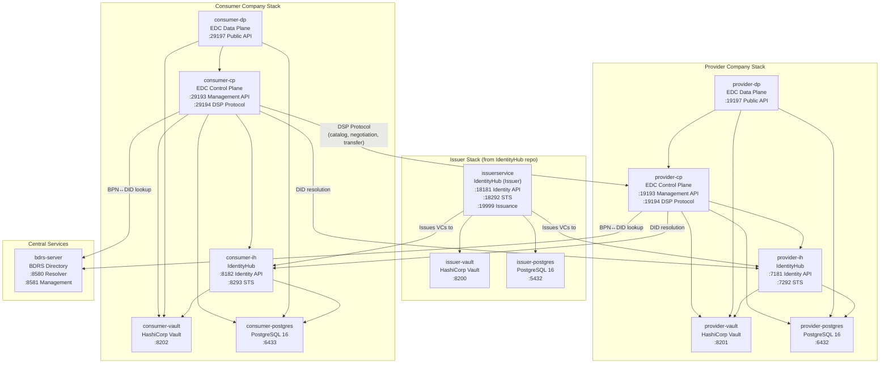
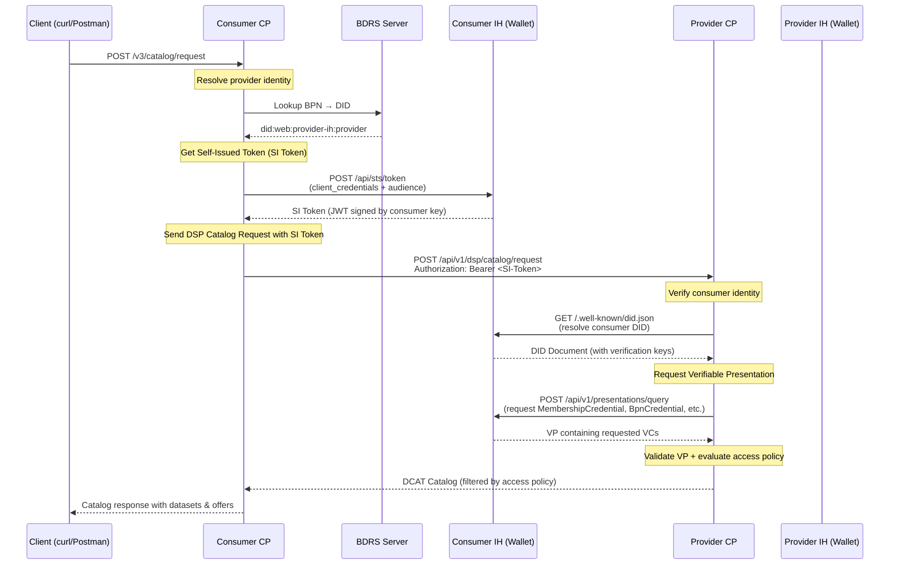
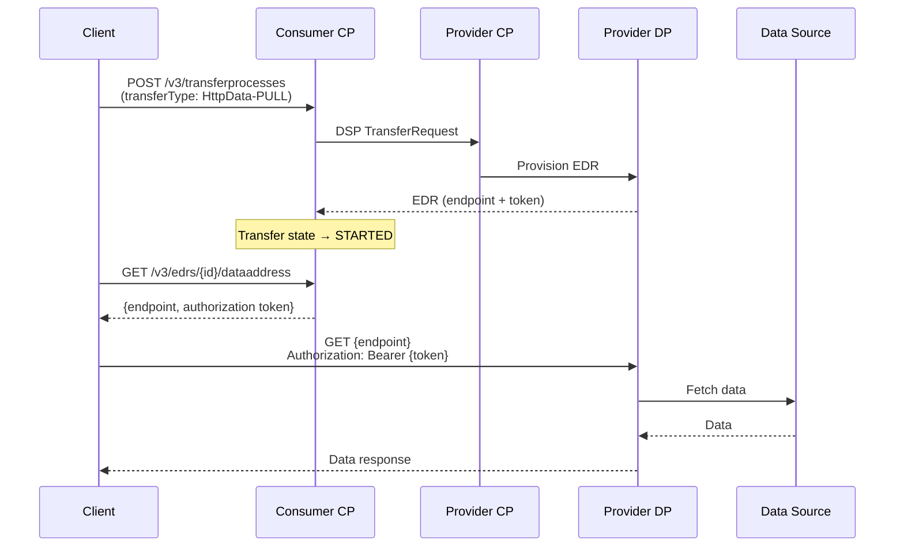
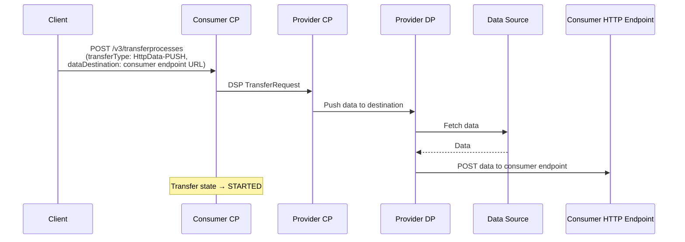

# Local DCP Deployment — Tractus-X EDC Connectors

Production-like local Docker deployment of **Tractus-X EDC connectors** with full
**Decentralized Claims Protocol (DCP)** authentication, per-company Identity Hubs,
Verifiable Credentials, and sovereign data exchange.

## What This Deploys

- **Provider + Consumer** EDC connector pair (Control Plane + Data Plane each)
- **Per-company Identity Hubs** (wallet/DID/VC management)
- **Issuer Service** (issues Membership, BPN, and DataExchangeGovernance credentials)
- **BDRS Server** (BPN ↔ DID resolution directory)
- **PostgreSQL** databases (one per company + issuer)
- **HashiCorp Vault** instances (one per company + issuer)
- **14 Docker containers** total on a shared `edc-net` bridge network

---

## Table of Contents

- [Architecture Overview](#architecture-overview)
- [Container Topology](#container-topology)
- [DCP Authentication Flow](#dcp-authentication-flow)
- [Data Transfer Patterns](#data-transfer-patterns)
- [Prerequisites](#prerequisites)
- [Quick Start](#quick-start)
- [Port Mappings](#port-mappings)
- [DID & Identity Configuration](#did--identity-configuration)
- [API Keys](#api-keys)
- [Available Scripts](#available-scripts)
- [Postman Collection](#postman-collection)
- [API Taxonomy: Upstream EDC vs Tractus-X](#api-taxonomy-upstream-edc-vs-tractus-x)
- [Troubleshooting](#troubleshooting)
- [Known Issues & Fixes](#known-issues--fixes)
- [Related Repositories](#related-repositories)

---

## Architecture Overview

The deployment follows a **per-company architecture** modeled after the
[Minimum Viable Dataspace (MXD)](https://github.com/eclipse-edc/MinimumViableDataspace)
reference. Each company (provider, consumer) has its own complete stack — IdentityHub,
Vault, and PostgreSQL — just like in production.



### Component Roles

| Component | Role |
|-----------|------|
| **Control Plane (CP)** | Orchestrates catalog browsing, contract negotiation, transfer initiation. Hosts the Management API for external clients and the DSP endpoint for connector-to-connector protocol. |
| **Data Plane (DP)** | Handles actual data transfer — serves data for PULL requests (via EDR tokens) and pushes data to consumer-provided HTTP endpoints for PUSH transfers. |
| **IdentityHub (IH)** | Per-company wallet. Manages DIDs, stores Verifiable Credentials, provides STS (Security Token Service) for DCP authentication. |
| **Issuer Service** | Trusted credential issuer. Issues MembershipCredential, BpnCredential, and DataExchangeGovernanceCredential to participants. |
| **BDRS Server** | Central directory mapping BPNs (Business Partner Numbers) to DIDs. Used during DCP authentication to resolve participant identities. |
| **Vault** | HashiCorp Vault for secret management — stores STS client secrets, transfer proxy signing keys (EC P-256 JWK), and API credentials. |
| **PostgreSQL** | Persistent storage for connector state (assets, policies, agreements, transfers), IdentityHub state (credentials, DIDs), and BDRS mappings. |

---

## Container Topology

All 14 containers run on a single Docker bridge network (`edc-net`):

```
┌─────────────────────────────────────────────────────────────────────────────────────────┐
│                                    edc-net (bridge)                                     │
│                                                                                         │
│   ┌─ Issuer Stack ──────────────┐  ┌─ Provider Company ──────────────────────────────┐  │
│   │ issuer-vault    (:8200)     │  │ provider-vault    (:8201)                       │  │
│   │ issuer-postgres (:5432)     │  │ provider-postgres (:6432)                       │  │
│   │ issuerservice   (:18181)    │  │ provider-ih       (:7181 identity, :7292 STS)   │  │
│   └─────────────────────────────┘  │ provider-cp       (:19193 mgmt, :19194 DSP)     │  │
│                                    │ provider-dp       (:19197 public data)           │  │
│   ┌─ Central ───────────────────┐  └─────────────────────────────────────────────────┘  │
│   │ bdrs-server (:8580/:8581)   │                                                       │
│   └─────────────────────────────┘  ┌─ Consumer Company ──────────────────────────────┐  │
│                                    │ consumer-vault    (:8202)                        │  │
│                                    │ consumer-postgres (:6433)                        │  │
│                                    │ consumer-ih       (:8182 identity, :8293 STS)    │  │
│                                    │ consumer-cp       (:29193 mgmt, :29194 DSP)      │  │
│                                    │ consumer-dp       (:29197 public data)            │  │
│                                    └─────────────────────────────────────────────────┘  │
└─────────────────────────────────────────────────────────────────────────────────────────┘
```

---

## DCP Authentication Flow

When the consumer requests the provider's catalog, a full DCP authentication flow occurs:



### Key Identity Concepts

| Concept | Example | Purpose |
|---------|---------|---------|
| **DID** | `did:web:provider-ih:provider` | Decentralized Identifier — resolves to a DID Document via HTTP |
| **BPN** | `BPNL000000000001` | Business Partner Number — business-level identity in Catena-X |
| **SI Token** | JWT signed by connector's key | Short-lived token proving the caller's identity to the counterparty |
| **VP** | Verifiable Presentation | Container for VCs, presented to prove claims |
| **VC** | MembershipCredential, BpnCredential | Verifiable Credential — signed assertion by a trusted issuer |

---

## Data Transfer Patterns

This deployment supports both data transfer modes defined by the
[Dataspace Protocol (DSP)](https://docs.internationaldataspaces.org/ids-knowledgebase/dataspace-protocol).

### Why Does the Consumer Always Initiate?

A common question: if the provider is the one pushing data, why does the **consumer** start the
transfer? The answer is **data sovereignty** — the core principle of dataspace architectures.

In a traditional point-to-point integration, the provider could simply POST data to a known URL.
But in a dataspace, every data exchange must be **governed**:

| Principle | What It Ensures |
|-----------|-----------------|
| **Contract-backed** | No data flows without a signed contract agreement between both parties |
| **Policy enforcement** | Usage policies (e.g., "only for quality analysis", "FrameworkAgreement required") are verified at transfer time |
| **Audit trail** | Every transfer is tied to a contract agreement ID, enabling full traceability |
| **Dynamic destinations** | The consumer decides where data should be delivered — different endpoint per use case |
| **Revocability** | Either party can terminate an active transfer at any time |

The consumer's transfer request is the **authorization gate**: it triggers the provider's Control
Plane to verify a valid contract exists and all policies are satisfied before any data moves.

**Traditional API** — provider sends data unilaterally → no governance, no audit, no policy check.

**Dataspace (DSP)** — consumer says *"I have contract X for asset Y, deliver to my endpoint"* →
provider verifies → then pushes → governed data exchange.

### PULL vs PUSH — What's Different?

| Aspect | HttpData-PULL | HttpData-PUSH |
|--------|--------------|---------------|
| **Who fetches data?** | Consumer (via EDR token) | Provider Data Plane |
| **Who receives data?** | Consumer's client application | Any HTTP endpoint the consumer provides (REST API, data ingestion service, webhook, etc.) |
| **Consumer Data Plane needed?** | No (client calls provider DP directly) | **No** (only an HTTP endpoint that can receive POST requests) |
| **Provider Data Plane needed?** | Yes (serves data via public API) | Yes (fetches from source + POSTs to consumer's endpoint) |
| **Transfer lifecycle** | STARTED → consumer polls EDR → fetches when ready | STARTED → provider pushes immediately |
| **Use case** | On-demand data retrieval | Event-driven delivery, notifications, data pipelines |

> **Non-finite (streaming) PUSH**: For continuous data feeds, the consumer initiates a non-finite
> PUSH transfer. The transfer stays in `STARTED` state indefinitely, and the provider keeps pushing
> data to the consumer's endpoint as events occur. Either party can terminate the transfer when done.

### Sequence Diagrams

#### HttpData-PULL (Consumer fetches data)



#### HttpData-PUSH (Provider pushes data to consumer's endpoint)

The consumer specifies their HTTP endpoint URL (any REST API, data ingestion service, webhook, etc.)
in the `dataDestination`. The provider's Data Plane fetches data from the source and POSTs it to
that endpoint. In our local tests, we use a webhook service (e.g., webhook.site) as a stand-in
since there is no real consumer backend.



---

## Prerequisites

### 1. Identity Hub + Issuer Stack (from separate repo)

The issuer stack (issuerservice, issuer-vault, issuer-postgres) must be running on the
`edc-net` Docker network **before** starting the EDC stack.

**IdentityHub Repository:**
[Federity-X/public-tractusx-identityhub (branch: dcp-flow-local-deployment-with-upstream-0.15.1)](https://github.com/Federity-X/public-tractusx-identityhub/tree/dcp-flow-local-deployment-with-upstream-0.15.1)

```bash
# Clone the IdentityHub repo
git clone -b dcp-flow-local-deployment-with-upstream-0.15.1 \
  https://github.com/Federity-X/public-tractusx-identityhub.git
cd public-tractusx-identityhub

# Build IdentityHub JARs (must complete before Docker build)
./gradlew clean build

# Build the IdentityHub Docker image
docker build -t identityhub:local runtimes/identityhub/

# Start the issuer stack
cd deployment/local
docker compose up -d
```

See the [IdentityHub deployment README](https://github.com/Federity-X/public-tractusx-identityhub/tree/dcp-flow-local-deployment-with-upstream-0.15.1/deployment/local) for full setup instructions.

### 2. Docker & Docker Compose

- Docker Desktop (macOS/Windows) or Docker Engine (Linux)
- Docker Compose v2+
- Create the shared Docker network (once): `docker network create edc-net`

### 3. Java 21

Required for building the EDC connector JARs:
```bash
java -version  # Should show 21+
```

### 4. Tools

- `curl` — API calls
- `jq` — JSON parsing
- `openssl` — key generation (used by bootstrap script)

---

## Quick Start

```bash
# 1. Ensure the shared Docker network exists
docker network create edc-net 2>/dev/null || true

# 2. Ensure the issuer stack is running (from the IdentityHub repo)
docker ps | grep issuerservice  # Should show issuerservice container

# 3. Build EDC JARs (from tractusx-edc repo root)
cd /path/to/tractusx-edc
./gradlew clean build

# 4. Build EDC Docker images
docker build -t edc-controlplane:local \
  --build-arg JAR=edc-controlplane/edc-controlplane-postgresql-hashicorp-vault/build/libs/edc-controlplane-postgresql-hashicorp-vault.jar \
  -f deployment/local/Dockerfile .

docker build -t edc-dataplane:local \
  --build-arg JAR=edc-dataplane/edc-dataplane-hashicorp-vault/build/libs/edc-dataplane-hashicorp-vault.jar \
  -f deployment/local/Dockerfile .

# 5. Start infrastructure + connectors
cd deployment/local
docker compose up -d

# 6. Wait for all containers to become healthy (~30s)
docker ps --format 'table {{.Names}}\t{{.Status}}' | sort

# 7. Run bootstrap (participant creation, vault seeding, credential issuance,
#    BDRS seeding, asset + policy creation, E2E verification)
bash scripts/bootstrap.sh

# 8. Run end-to-end test (catalog → negotiate → transfer → pull data)
bash scripts/test-transfer.sh
```

---

## Port Mappings

### Issuer Stack (from IdentityHub repo)

| Container | Host Port | Purpose |
|-----------|-----------|---------|
| issuer-vault | 8200 | HashiCorp Vault (issuer secrets) |
| issuer-postgres | 5432 | PostgreSQL (issuer + BDRS databases) |
| issuerservice | 18181 | Identity API |
| issuerservice | 18292 | STS (Security Token Service) |
| issuerservice | 13132 | Resolution API |
| issuerservice | 15152 | Issuance Endpoint |
| issuerservice | 19999 | Credential Issuance API |

### Provider Stack

| Container | Host Port | Purpose |
|-----------|-----------|---------|
| provider-vault | 8201 | HashiCorp Vault |
| provider-postgres | 6432 | PostgreSQL (connector + IH databases) |
| provider-ih | 7181 | Identity API (DID, credentials) |
| provider-ih | 7292 | STS (Security Token Service) |
| provider-ih | 7131 | Resolution API |
| provider-ih | 7151 | Identity Management API |
| provider-ih | 7100 | DID Document (`.well-known`) |
| provider-cp | 19191 | Default API (health check) |
| provider-cp | 19192 | Control API |
| provider-cp | 19193 | **Management API** (primary interaction endpoint) |
| provider-cp | 19194 | DSP Protocol (connector-to-connector) |
| provider-cp | 19195 | Catalog API |
| provider-dp | 19196 | Default API (health check) |
| provider-dp | 19197 | **Public API** (data transfer endpoint) |
| provider-dp | 19198 | Control API |

### Consumer Stack

| Container | Host Port | Purpose |
|-----------|-----------|---------|
| consumer-vault | 8202 | HashiCorp Vault |
| consumer-postgres | 6433 | PostgreSQL (connector + IH databases) |
| consumer-ih | 8182 | Identity API |
| consumer-ih | 8293 | STS |
| consumer-ih | 8132 | Resolution API |
| consumer-ih | 8152 | Identity Management API |
| consumer-ih | 8100 | DID Document |
| consumer-cp | 29191 | Default API (health check) |
| consumer-cp | 29192 | Control API |
| consumer-cp | 29193 | **Management API** |
| consumer-cp | 29194 | DSP Protocol |
| consumer-cp | 29195 | Catalog API |
| consumer-dp | 29196 | Default API (health check) |
| consumer-dp | 29197 | **Public API** |
| consumer-dp | 29198 | Control API |

### Central Services

| Container | Host Port | Purpose |
|-----------|-----------|---------|
| bdrs-server | 8580 | BPN ↔ DID resolution (directory lookup) |
| bdrs-server | 8581 | BDRS Management API |

---

## DID & Identity Configuration

| Entity | DID | BPN |
|--------|-----|-----|
| Provider | `did:web:provider-ih:provider` | `BPNL000000000001` |
| Consumer | `did:web:consumer-ih:consumer` | `BPNL000000000002` |
| Issuer | `did:web:issuerservice:issuer` | — |

### Verifiable Credentials Issued

Each participant (provider, consumer) receives 3 VCs from the issuer:

| Credential Type | Purpose |
|----------------|---------|
| `MembershipCredential` | Proves active Catena-X membership |
| `BpnCredential` | Binds BPN to DID identity |
| `DataExchangeGovernanceCredential` | Authorizes data exchange under framework agreements |

---

## API Keys

| Service | Header | Value |
|---------|--------|-------|
| Connector Management API | `x-api-key` | `testkey` |
| IdentityHub / Issuer Service | `x-api-key` | `c3VwZXItdXNlcg==.superuserkey` |
| BDRS Management API | `x-api-key` | `testkey` |

---

## Available Scripts

| Script | Purpose |
|--------|---------|
| [`scripts/bootstrap.sh`](scripts/bootstrap.sh) | Full environment bootstrap (16 steps): participant creation, vault seeding, DID document setup (CredentialService + DataService endpoints), credential issuance, BDRS seeding, asset/policy setup, E2E verification |
| [`scripts/test-transfer.sh`](scripts/test-transfer.sh) | E2E transfer test: catalog → negotiate → PULL transfer → pull data |
| [`scripts/test-push-transfer.sh`](scripts/test-push-transfer.sh) | E2E PUSH transfer test: asset creation → negotiate → PUSH data to consumer endpoint (uses webhook.site as stand-in) |
| [`scripts/demo-management-api.sh`](scripts/demo-management-api.sh) | Comprehensive 20-operation Management API demo covering all endpoints |

---

## Postman Collection

A fully dynamic Postman collection is available at:

```
postman/EDC_Management_API_DCP.postman_collection.json
```

**Features:**
- **16 folders**, **68 requests** covering the complete EDC Management API v3 + TX extensions
- **65 assertions, 0 failures** — all endpoints return actual success responses
- Auto-generated unique resource IDs (no conflicts between runs)
- Variable chaining — offer IDs, agreement IDs, transfer IDs, EDR tokens auto-extracted
- Pre-request guards on all requests with dynamic URL variables
- Retry loops for polling (negotiation + transfer status)
- Both **PULL** and **PUSH** transfer patterns
- "Sacrificial negotiation" pattern for testing state-machine transitions (terminate, delete)
- Rich documentation on every request and folder
- Can be run via [newman](https://www.npmjs.com/package/newman):

```bash
npm install -g newman
newman run postman/EDC_Management_API_DCP.postman_collection.json
```

> **Note:** The collection includes built-in 2-second delays between polling retries (negotiation,
> transfer, resume). No extra flags are needed. If you still see timeouts on slower machines,
> add `--delay-request 2000 --timeout-request 30000` to the command above.

---

## API Taxonomy: Upstream EDC vs Tractus-X

Tractus-X EDC is built on top of the [Eclipse EDC Connector](https://github.com/eclipse-edc/Connector).
Understanding which endpoints come from upstream vs Tractus-X is critical for troubleshooting,
upgrades, and understanding the Catena-X architecture.

### Pure Upstream EDC Endpoints (Used As-Is)

These endpoints come directly from Eclipse EDC with **zero modification**. The CRUD operations,
request formats, and behavior are identical to vanilla EDC:

| API Path | Endpoints | Purpose |
|----------|-----------|----------|
| `/v3/assets` | 5 (CRUD + query) | Register data offerings with metadata and data addresses |
| `/v3/policydefinitions` | 7 (CRUD + query + validate + eval plan) | Define ODRL access & contract policies |
| `/v3/contractdefinitions` | 4 (CRUD + query) | Link assets to policies — makes them negotiable |
| `/v3/catalog/request` | 3 (full + filtered + dataset) | Browse provider offerings via DSP |
| `/v3/contractnegotiations` | 6 (initiate + poll + query + state + agreement + terminate) | Consumer-initiated contract negotiation |
| `/v3/contractagreements` | 3 (get + query + negotiation) | Inspect finalized agreements |
| `/v3/transferprocesses` | 8 (initiate + poll + query + state + suspend + resume + terminate + deprovision) | Manage data transfers |

> **Why unmodified?** These are the standard Dataspace Protocol (DSP) building blocks.
> Tractus-X adds value through *policy functions* and *extensions*, not by changing core CRUD.

### TX-Customized Endpoints (Extended Upstream Behavior)

These use upstream EDC API paths but Tractus-X **replaces or extends** the implementation:

| API Path | What TX Changes | Why |
|----------|-----------------|-----|
| `GET /v3/edrs/{id}/dataaddress` | **Auto-refresh** (`?auto_refresh=true`) — TX's `edr-api-v2` replaces upstream `edr-cache-api`. Checks token expiry and auto-renews. | Long-running data exchanges need token refresh without re-negotiation. |
| `POST /v3/edrs/{id}/refresh` | **Force refresh** — explicitly request a new EDR token. Not in upstream. | On-demand token renewal for time-sensitive operations. |
| `DELETE /v3/edrs/{id}` | **EDR deletion** — remove cached EDR entries. | Cache hygiene for completed transfers. |
| `POST /v3/edrs` | **EDR Negotiation Initiation** — single call triggers contract negotiation + automatic EDR retrieval. | Simplifies the 3-step flow (negotiate → transfer → get EDR) into one call. |
| `POST /v3/edrs/request` | **EDR query with filters** — query cached EDRs by asset ID, agreement ID, etc. | Cache inspection across multiple active data exchanges. |

**CX Policy Engine Extensions** (invisible at the API level, but critical):

Tractus-X registers **25+ custom ODRL constraint functions** via `edc-extensions/cx-policy/` that
execute during catalog requests, negotiations, and transfers:

| Left Operand | Purpose |
|--------------|----------|
| `cx-policy:FrameworkAgreement` | Require specific CX framework agreement (e.g., `DataExchangeGovernance:1.0`) |
| `cx-policy:UsagePurpose` | Restrict data usage to specific purposes (e.g., `cx.core.industrycore:1`) |
| `cx-policy:BusinessPartnerNumber` | Restrict access to specific BPNLs |
| `cx-policy:BusinessPartnerGroup` | Restrict access by BPN group membership (uses BPN Groups API below) |
| `cx-policy:Membership` | Require valid CX membership credential |
| `cx-policy:Dismantler` | Require dismantler credential |
| ... | 15+ more: warranty, liability, jurisdiction, data usage end date, etc. |

> **Why custom policies?** Upstream EDC has a generic policy engine that understands ODRL syntax
> but has no domain knowledge. Catena-X needs automotive-specific constraints (framework
> agreements, dismantler credentials, usage purposes) that map to Verifiable Credentials in the
> participant's Identity Hub wallet.

### TX-Added Endpoints (Entirely New)

These endpoints are **entirely new** — created by Tractus-X extensions to solve Catena-X-specific
problems not addressed by upstream EDC:

| API Path | Endpoints | Extension Module | Why It Exists |
|----------|-----------|-----------------|---------------|
| `/v3/business-partner-groups` | 6 (CRUD + query by BPN/group) | `edc-extensions/bpn-validation` | **Group-based access control.** Instead of listing every BPNL in a policy, operators create groups ("gold-partners", "tier-1-suppliers") and use `BusinessPartnerGroup` constraints. |
| `/v3/contractagreements/retirements` | 3 (retire + query + reactivate) | `edc-extensions/agreements` | **Compliance lifecycle.** Upstream EDC has no concept of "retiring" an agreement. In Catena-X, business relationships change — retirement makes agreements inactive while preserving the audit trail. |
| `/v4alpha/connectordiscovery` | 2 (DSP versions + discover) | `edc-extensions/connector-discovery` | **Multi-connector resolution.** Resolves which connector endpoints are available for a given participant DID/BPN and what DSP versions they support. |
| `/v4alpha/dataflows/{id}/trigger` | 1 | `edc-extensions/dataplane/dataflow` | **On-demand data push.** Manually trigger a data flow for event-driven or scheduled push scenarios. |

### TX Data Plane Extensions (Not Management API)

These TX extensions add endpoints on the **Data Plane** (not in this Postman collection):

| API Path | Extension Module | Purpose |
|----------|-----------------|----------|
| `/token` | `dataplane-token-refresh` | OAuth2-compatible token refresh for active EDRs |
| `/aas/request` | `dataplane-proxy-consumer-api` | Direct asset fetch bypassing Management API |

### Supporting TX Extensions (No New Endpoints)

These don't expose API endpoints but modify runtime behavior:

| Module | Purpose |
|--------|---------|
| `bdrs-client` | Resolves DID ↔ BPN mappings via BDRS server |
| `tokenrefresh-handler` | Background EDR token refresh service |
| `provision-additional-headers` | Injects BPNL headers into outgoing HTTP requests |
| `data-flow-properties-provider` | Enriches data flows with participant context |
| `token-interceptor` | Token injection at HTTP client level |
| `validators` | Blocks empty asset selectors in contract definitions |
| `agreements-bpns` | Stores BPNL associations on negotiation events |
| `dcp/` | W3C VC caching + DIV integration |

---

## Troubleshooting

### Check all containers are running

```bash
docker ps --format 'table {{.Names}}\t{{.Status}}\t{{.Ports}}' | sort
# All 14 containers should show "Up"
```

### View connector logs

```bash
docker logs provider-cp -f --tail 100   # Provider Control Plane
docker logs consumer-cp -f --tail 100   # Consumer Control Plane
docker logs provider-dp -f --tail 100   # Provider Data Plane
docker logs provider-ih -f --tail 100   # Provider Identity Hub
docker logs issuerservice -f --tail 100 # Issuer Service
```

### Health checks

```bash
# EDC connectors
curl -s http://localhost:19191/api/check/health | jq .  # Provider CP
curl -s http://localhost:19196/api/check/health | jq .  # Provider DP
curl -s http://localhost:29191/api/check/health | jq .  # Consumer CP
curl -s http://localhost:29196/api/check/health | jq .  # Consumer DP

# Identity Hubs
curl -s http://localhost:7100/provider/did.json | jq .  # Provider DID Document
curl -s http://localhost:8100/consumer/did.json | jq .  # Consumer DID Document
curl -s http://localhost:18100/issuer/did.json | jq .   # Issuer DID Document

# BDRS
curl -s http://localhost:8580/api/check/health | jq .  # BDRS health
curl -s http://localhost:8581/api/management/bpn-directory \
  -H "x-api-key: testkey" | jq .  # BDRS directory contents
```

### Common issues

| Symptom | Likely Cause | Fix |
|---------|-------------|-----|
| BDRS shows unhealthy | Missing default web port config | Ensure `WEB_HTTP_PORT` and `WEB_HTTP_PATH` are set in BDRS environment |
| Catalog returns empty | Access policy mismatch or missing VCs | Check `docker logs consumer-cp` for DCP auth errors |
| Negotiation TERMINATED | Policy action format wrong | Use `{"@id": "odrl:use"}` not `"use"` |
| 401 on DSP endpoint | SI token audience mismatch | Verify `edc.participant.id` = full DID on CPs |
| Transfer stuck at REQUESTED | Data plane not reachable | Check `edc.hostname` on DP config |
| EDR token invalid | Transfer proxy key format | Must be EC P-256 JWK in Vault |
| `IRI_CONFUSED_WITH_PREFIX` | Compact IRI in leftOperand | Use full IRI: `https://w3id.org/catenax/2025/9/policy/...` |

### Clean up

> **Important**: Always tear down **both** compose stacks with `-v` when doing a fresh restart.
> The issuer stack (IdentityHub) uses a separate PostgreSQL volume. If only the EDC stack is
> removed, the issuer database retains stale participant/keypair data while the Vault (dev mode,
> in-memory) loses all secrets — causing credential issuance failures (`Private key not found`).

```bash
# 1. Stop issuer stack FIRST (from IdentityHub repo)
cd /path/to/public-tractusx-identityhub/deployment/local
docker compose down -v

# 2. Stop EDC stack
cd /path/to/tractusx-edc/deployment/local
docker compose down -v
```

---

## Known Issues & Fixes

See [docs/development/local-dcp-issues-and-fixes.md](../../docs/development/local-dcp-issues-and-fixes.md)
for a comprehensive catalog of all 14 issues encountered during setup and their exact fixes.

---

## Related Repositories

| Repository | Branch | Purpose |
|------------|--------|---------|
| [tractusx-edc](https://github.com/Federity-X/public-tractusx-edc/tree/dcp) (this repo) | `dcp` | EDC Connectors + Data Planes + CX extensions |
| [public-tractusx-identityhub](https://github.com/Federity-X/public-tractusx-identityhub/tree/dcp-flow-local-deployment-with-upstream-0.15.1) | `dcp-flow-local-deployment-with-upstream-0.15.1` | Identity Hub + Issuer Service (DID, VC, STS) |
| [MinimumViableDataspace](https://github.com/eclipse-edc/MinimumViableDataspace) | `main` | Reference architecture this deployment is modeled after |

---

## Directory Structure

```
deployment/local/
├── README.md                      ← This file
├── PRODUCTION_DEPLOYMENT_GUIDE.md ← What to change for production (infra team reference)
├── Dockerfile                     ← Multi-stage Docker build for CP and DP
├── docker-compose.yaml            ← 11 containers (provider, consumer, BDRS) + 3 from IH repo = 14 total
├── config/
│   ├── provider-cp.properties     ← Provider Control Plane config
│   ├── provider-dp.properties     ← Provider Data Plane config
│   ├── provider-ih.properties     ← Provider Identity Hub config
│   ├── provider-init.sql          ← Provider PostgreSQL init (creates edc + ih DBs)
│   ├── consumer-cp.properties     ← Consumer Control Plane config
│   ├── consumer-dp.properties     ← Consumer Data Plane config
│   ├── consumer-ih.properties     ← Consumer Identity Hub config
│   ├── consumer-init.sql          ← Consumer PostgreSQL init
│   └── ih-logging.properties      ← Identity Hub logging config
├── scripts/
│   ├── bootstrap.sh               ← Full bootstrap (16 steps, ~1068 lines)
│   ├── test-transfer.sh           ← E2E PULL transfer test
│   ├── test-push-transfer.sh      ← E2E PUSH transfer test
│   └── demo-management-api.sh     ← Comprehensive 20-operation API demo
└── postman/
    └── EDC_Management_API_DCP.postman_collection.json  ← 65-request dynamic collection (16 folders)
```
